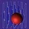

# МОКБ «Марс»
> 2019.04.01 **[🚀](../index/index.md) [despace](index.md)** → [Contact](contact.md)

||*Россия, 127473, г. Москва, 1‑й Щемиловский пер., 16*|
|:--|:--|
|E‑mail| <office@mars-mokb.ru> |
|Link| <http://www.mars-mokb.ru/>  <https://ru.wikipedia.org/wiki/МОКБ_«Марс»> |
|Tel| +7(495)688-64-44, ℻: +7(499)973-18-96 |

**ФГУП МОКБ «Марс»** — разработчик бортовых систем автоматического управления и навигации авиационными и космическими летательными аппаратами. С 01.02.2018 на основании Указа Президента РФ № 609 от 21.12.2017 ФГУП МОКБ «Марс» находится в ведомственном подчинении Госкорпорации «РОСАТОМ».

 

## МОКБ «Марс», comments

Приказом Министерства авиационной промышленности (МАП) № 389 от 13 июня 1955 года, выпущенным в развитие распоряжения министров Совета Министров СССР № 4652 от 9 июня 1955 года, вновь образованное предприятие было тематически определено  
*«… как специализированная научно‑исследовательская организация по разработке и изготовлению астронавигационных систем управления»*  
и получило наименование Филиал № 1 НИИ‑1.

В дальнейшем название организации неоднократно менялось: отделение № 1 НИИ‑923, филиал № 1 МИЭА и, наконец, с 1979 года — МОКБ «Марс».

Главным конструктором был назначен Рубен Григорьевич Чачикян. С его именем связано образование конструкторского бюро, его становление и формирование коллектива в первые годы.
