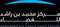

# MBRSC
> 2020.02.12 [🚀](../index/index.md) [despace](index.md) → [Contact](contact.md)

||<info@mbrsc.ae>, +971(4)607-12-00, Fax: …;  *Al Khawaneej Street,Al Khawaneej, Dubai, ОАЭ*|
|:--|:--|
|Link|<http://www.mbrsc.ae/>  <https://en.wikipedia.org/wiki/Mohammed_bin_Rashid_Space_Centre>  <https://ru.wikipedia.org/wiki/Mohammed_bin_Rashid_Space_Centre>|

**Космический центр имени Мухаммеда бин Рашида (Mohammed bin Rashid Space Centre, MBRSC)**, в состав которого входит Эмиратский институт передовых наук и технологий (EIAST) — правительственная организация Дубая, работающая над космической программой ОАЭ. Основан 2006.02.02 как EIAST, а 2015.04.17 расширен до MBRSC. Член [IAF](zz_iaf.md) с 2012 г.

Центр занимается продвижением космических технологий и научных исследований в регионе, реализовывая инновационные космические проекты и программы, поддерживает исследования страны в области космоса; осуществляет надзор за проектированием, производством и запуском спутников ОАЭ.

 

**Space projects:**

   - DubaiSat-1
   - DubaiSat-2
   - KhalifaSat
   - Nayif-1
   - Hope Mars Mission
