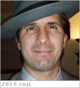

# McGouldrick, Kevin
> 2019.07.09 ┊ **🚀 [despace](index.md)** → **[Contact](contact.md)**

|*[Org.](contact.md)*|*[LASP](zz_lasp.md), US. Research Scientist*|
|:--|:--|
|i18n| <mark>TBD</mark> |
|Tel|*раб.:* +1(303)492-29-51, fax: +1(303)735-37-37; *моб.:* <mark>нетмобильного</mark> |
|E‑mail| <Kevin.McGouldrick@lasp.colorado.edu> |
|B‑day, addr.| <mark>нетдаты</mark> / … |
||  <mark>нетподписи</mark> |

   - **[Education](edu.md):** PhD Astrophysical, Planetary, & Atmospheric Sciences & MS Astrophysical, Planetary, & Atmospheric Sciences, Univ. of Colorado Boulder. BS Astronomy, Astrophysics, Physics, Pennsylvania State Univ.
   - **Exp.:** The primary focus of my research is the nature & evolution of the clouds of Venus. The sulfuric acid clouds of Venus reside between about 50 & 70 km above the surface of the planet, where temperatures & pressures resemble those at the surface of the Earth. These clouds are part of a highly coupled system involving numerous chemical reactions, absorption of both incident solar & emitted infrared radiation, & the global atmospheric circulation.
   - …
   - **SC/Equip.:** …
   - **Conferences:** 2019 [VEXAG 17](vexag_2019.md), 2019 [IVC](ivc_2019.md)
   - Git: …
   - Facebook: <https://www.facebook.com/kevin.mcgouldrick>
   - Instagram: <mark>нетинсты</mark>
   - LinkedIn: <https://www.linkedin.com/in/kevin-mcgouldrick-8a60648>
   - Twitter: <https://twitter.com/wwwheniheard>
   - <http://lasp.colorado.edu/home/personnel/kevin.mcgouldrick/>
   - <https://www.researchgate.net/scientific-contributions/71894664_Kevin_McGouldrick>
   - <https://www.researchgate.net/scientific-contributions/2147041353_Kevin_McGouldrick>
   - <https://nai.nasa.gov/directory/mcgouldrick-kevin/>
   - **As a person:**
      1. …
