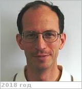

# Mills, Franklin
> 2019.07.11 **[🚀](../index/index.md) [despace](index.md)** → [Contact](contact.md)

|*[Org.](contact.md)*|*[ANU](zz_anu.md), AU. Senior Fellow.*|
|:--|:--|
|i18n|<mark>TBD</mark>|
|Tel|*раб.:* +612(61)250-116 & +612(61)255-015; *mobile:* <mark>nomobile</mark>|
|E‑mail|<frank.mills@anu.edu.au>|
|B‑day, addr.|<mark>nodate</mark> / …|
|| <mark>nosign</mark>|

   - **[Education](edu.md):** PhD (Planetary science), MS (Physics) (Caltech), BSE (Mechanical & Aerospace Engineering) (Princeton Univ.).
   - **Exp.:** I have a joint appointment at the ANU in the Research School of Physics & Engineering & The Fenner School of Environment & Society. I am also affiliated with the Planetary Science Institute, the Climate Change Institute, & the Energy Change Institute. I have supervised student research projects in the Astrophysics, Earth Science, Engineering, Environment, & Physics programmes. I convene & lecture in Thermal & Statistical Physics & contribute to Fundamentals of Climate System Science & Weather, Climate, & Fire. I am also a Supporting Investigator for the European Space Agency’s Venus Express mission & a member of the International Commission of Planetary Environments & their Evolution (ICPAE) of the International Association of Meteorology & Atmospheric Sciences (IAMAS). My principal resarch interests are the transmission of radiation through planetary atmospheres & its impact on atmospheric chemistry. My current research is in three areas: middle atmospheric chemistry on Venus & the Earth, analysis of data & simulations for Australian climate, & solar energy forecasting.
   - …
   - **SC/Equip.:** …
   - **Conferences:** 2019 [IVC](ivc_2019.md)
   - Git: …
   - Facebook: <mark>nofb</mark>
   - Instagram: <mark>noin</mark>
   - LinkedIn: <mark>noli</mark>
   - Twitter: <mark>notw</mark>
   - <https://climate.anu.edu.au/about-us/people/frank-mills>
   - <https://fennerschool.anu.edu.au/people/academics/dr-frank-mills>
   - **As a person:**
      1. …
