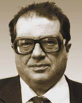

# Мороз, Василий Иванович
> 2019.11.17 **[🚀](../index/index.md) [despace](index.md)** → [Contact](contact.md)

|*[Org.](contact.md)*|*[ГАИШ МГУ](zz_sai_msu.md), SU. Профессор*|
|:--|:--|
|i18n| <mark>TBD</mark> |
|Tel| |
|E‑mail| |
|B‑day, addr.| 1931.05.20 ‑ 2004.06.23 / Москва, Россия |
||  |

   - **[Education](edu.md):** Доктор физико‑математических наук, МГУ.
   - **Exp.:** В 1954 ‑ 1956 годах работал в Астрофизическом институте АН КазССР, в 1956 ‑ 1974 годах — в ГАИШ, с 1974 года работал в Институте космических исследований АН СССР, заведующий отделом «Физика планет и малых тел Солнечной системы». Более 25 лет преподавал в МГУ, профессор.
   - Астроном. Основные труды в области планетологии — физики планет Солнечной системы. Одним из первых в СССР начал наблюдения небесных объектов в инфракрасном диапазоне. Провёл цикл исследований планет и спутников методами инфракрасной спектроскопии, в результате которых были обнаружены окись углерода в атмосфере Венеры и полосы кристаллизационной воды в спектре отражения марсианского грунта, пересмотрены оценки давления в марсианской атмосфере, изучены спектральные особенности галилеевых спутников Юпитера и открыты ледяные оболочки Ганимеда, Европы и Каллисто. Руководил рядом научных экспериментов на советских КА к Марсу и Венере. В числе этих экспериментов наиболее важен цикл работ по измерению содержания водяного пара в атмосферах Марса и Венеры оптическими методами, в частности, спектрометрами спускаемых аппаратов «Венера‑11» и «Венера‑12» в 1978 году от облаков до поверхности Венеры измерен профиль содержания водяного пара. Принимал участие в проекте «Вега». Автор более 260 публикаций в научных журналах, а также монографий «Физика планет» (1967) и «Физика планеты Марс» (1978), соавтор учебника «Курс общей астрономии».
   - **SC/Equip.:** …
   - **Conferences:** …
   - Git: …
   - Facebook: 
   - Instagram: 
   - LinkedIn: 
   - Twitter: 
   - <https://ru.wikipedia.org/wiki/Мороз,_Василий_Иванович>
