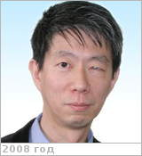

# Nakamura, Masato
> 2019.10.21 [🚀](../index/index.md) [despace](index.md) → [Contact](contact.md)

|*[Org.](contact.md)*|*[ISAS](zz_isas.md)/[JAXA](zz_jaxa.md), JP.*|
|:--|:--|
|B‑day, addr.|<mark>nodate</mark> 1959  / …|
|Contact|<mnakamur@isas.jaxa.jp>, *work:* +81(50)336-239-36; *mobile:* <mark>nomobile</mark>|
|i18n|<mark>TBD</mark>|
|| <mark>nosign</mark> |

   - **[Education](edu.md):** PhD, Tokyo Univ., 1977 ‑ 1987.
   - **Exp.:** ISAS/JAXA, Professor, 2002 ‑ Present. Tokyo Univ., Associate Professor, 1993 ‑ 2002.
   - …
   - **SC/Equip.:** 2010 [Akatsuki](akatsuki.md)
   - **Conferences:** [2019 IVC](ivc_2019.md)
   - Git: …
   - Facebook: <mark>nofb</mark>
   - Instagram: <mark>noin</mark>
   - LinkedIn: <https://www.linkedin.com/in/masato-nakamura-5290a375>
   - Twitter: <mark>notw</mark>
   - <https://www.researchgate.net/profile/Masato_Nakamura3>
   - **As a person:**
      1. …
