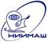

# НИИМАШ
> 2019.04.01 **[🚀](../index/index.md) [despace](index.md)** → [Contact](contact.md)

||*Россия, 624740, Свердловская область, г. Нижняя Салда, ул. Строителей, 72*|
|:--|:--|
|E‑mail|<mail@niimashspace.ru>, <info@niimashspace.ru>|
|Link|<http://www.niimashspace.ru/>|
|Tel|+7(34345)3-64-59, ℻: +7(34345)3-06-54, +7(34345)3-17-03|

**Федеральное государственное унитарное предприятие «Научно‑исследовательский институт машиностроения» (ФГУП НИИМАШ)** является ведущим предприятием российской ракетно‑космичской отрасли в области создания и изготовления ракетных двигателей малой тяги для управления полетом космических аппаратов различного назначения. Основной вид деятельности предприятия — создание, производство и испытания ракетных двигателей малой тяги и двигательных установок космических аппаратов на их основе, включающее проведение научно‑исследовательских и поисковых экспериментальных работ, проектирование, изготовление опытных образцов, наземную экспериментальную отработку, изготовление, испытания и поставки продукции для лётной эксплуатации, инженерное сопровождение эксплуатации.

 

## НИИМАШ, comments

…
