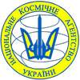

# ГКА
> 2019.08.07 **[🚀](../index/index.md) [despace](index.md)** → [Contact](contact.md)

||*…*|
|:--|:--|
|E‑mail| <mark>noemail</mark> |
|Link| <http://www.nkau.gov.ua/NSAU/nkau.nsf>  <https://ru.wikipedia.org/wiki/Государственное_космическое_агентство_Украины>  <https://uk.wikipedia.org/wiki/Державне_космічне_агентство_України> |
|Tel| <mark>noworkphone</mark>, ℻: … |

**Государственное космическое агентство Украины (ГКА)** *(укр. Державне космічне агентство України (ДКА))* — специально уполномоченный центральный орган исполнительной власти Украины, который обеспечивает реализацию государственной политики в области космической деятельности, осуществляет руководство порученной ему сферой управления, несёт ответственность за состояние её развития. До 9 декабря 2010 именовалось Национальное космическое агентство Украины (НКАУ). Основано 29 февраля 1992 года.

 

## ГКА, comments

…
