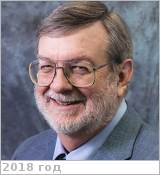

# Nock, Kerry T.
> 2019.01.17 ┊ **[🚀](../index/index.md) [despace](index.md)** → **[Contact](contact.md)**

|*[Org.](contact.md)*|*[Global Aerospace Corporation](zz_gac.md), US. Founder, President, Chairman of the Board of Directors*|
|:--|:--|
|B‑day, addr.| <mark>nodate</mark> 1946 ? / … |
|E‑mail| <mark>noemail</mark> |
|i18n| Нок, Керри |
|Tel| *work:* <mark>noworkphone</mark>; *mobile:* <mark>nomobile</mark> |
||  <mark>nosign</mark>  |

   - **[Education](edu.md):** MS, 1966 ‑ 1972, Space Science & Engineering, UCLA.
   - **Exp.:** Past Fellow of NASA Institute for Advanced Concepts (NIAC) & PI for 2 NIAC Phase II studies, one developing a concept for networks of guided balloons for Earth science & the other study to develop an Earth‑to‑Mars transportation architecture. Principal inventor of 2 new devices including a safe & low cost satellite de‑orbit system for low‑Earth orbit spacecraft & a revolutionary & scalable entry system that can offer more returned mass for same launch mass while enabling the use of small diameter launchers. PI of a unique subsea & aerospace system development for the Defense Dept. Has authored or co‑authored over 80 papers & articles & is a past associate editor of the American Institute of Aeronautics & Astronautics (AIAA) Journal of Spacecraft & Rockets. An expert in systems engineering, celestial mechanics, mission design & analysis, advanced studies & technology development & flight operations planning. He has carried out a variety of activities in aerospace systems development. Managed the first studies of planetary aerobraking that was eventually used at Mars & Venus. A friend of [V. Dolgopolov](zz_dolgopolov1.md).
   - Specialties: Program Management, Advanced Concept Development, Technology Development, Astrodynamics, Space Mission Design.
   - **SC/Equip.:** 1986 [Venus Sample Return Mission](venus_sample_return_mission.md), 1989 [Magellan](magellan.md), … Cassini, 1973 [Mariner 10](mariner_10.md), … Mariner 9, … Voyager, … Galileo
   - **Conferences:** …
   - Git: …
   - Facebook: <mark>nofb</mark>
   - Instagram: <mark>noin</mark>
   - LinkedIn: <https://www.linkedin.com/in/kerry-nock-3269a63>
   - Twitter: <mark>notw</mark>
   - <http://www.gaerospace.com/about/>
   - <https://patents.justia.com/inventor/kerry-t-nock>
   - <https://www.researchgate.net/profile/Kerry_Nock>
   - **As a person:**
      1. …
