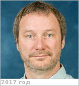

# Parkinson, Christopher Dennis
> 2019.07.09 **[🚀](../index/index.md) [despace](index.md)** → [Contact](contact.md)

|*[Org.](contact.md)*|*[Michigan Univ.](zz_michigan_univ.md), US. Department of Climate & Space Science & Engineering. Associate Research Scientist, Climate & Space Sciences & Engineering, College of Engineering*|
|:--|:--|
|B‑day, addr.| <mark>nodate</mark> / … |
|E‑mail| <theshire@umich.edu> |
|i18n| <mark>TBD</mark> |
|Tel|*раб.:* +1(734)647-35-40; *mobile:* +1(626)818-92-93 |
||  <mark>nosign</mark> |

   - **[Education](edu.md):** PhD, Earth & Space Science, York University, Toronto. Thesis: Photochemistry & radiative transfer studies in the atmospheres of Jupiter & Saturn (<http://www.gps.caltech.edu/~cdp/> Thesis). M.Sc., Earth & Space Science, York University, Toronto. Thesis: On approximating positive solutions to some nonlinear integro-differential equations. HBSc, Science, York University, Toronto.
   - **Exp.:** …
   - …
   - **SC/Equip.:** …
   - **Conferences:** 2019 [IVC](ivc_2019.md)
   - Git: …
   - Facebook: <https://www.facebook.com/christopher.parkinson.332>
   - Instagram: <mark>noin</mark>
   - LinkedIn: <https://www.linkedin.com/in/christopher-parkinson-546b146>
   - Twitter: <mark>notw</mark>
   - <https://mcommunity.umich.edu/#profile:THESHIRE>
   - <https://www.researchgate.net/profile/Christopher_Parkinson2>
   - <https://clasp.engin.umich.edu/people/christopher-parkinson/>
   - **As a person:**
      1. …
