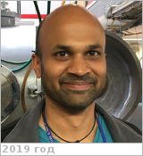

# Patel, Manish
> 2019.07.17 **[🚀](../index/index.md) [despace](index.md)** → [Contact](contact.md)

|*[Org.](contact.md)*|*[Open Univ.](zz_open_univ.md), EU. Faculty of Science, Technology, Engineering & Mathematics School of Physical Sciences. Senior Lecturer*|
|:--|:--|
|B‑day, addr.|<mark>nodate</mark> / …|
|E‑mail|<manish.patel@open.ac.uk>|
|i18n|<mark>TBD</mark>|
|Tel|*раб.:* <mark>noworkphone</mark>; *mobile:* <mark>nomobile</mark>|
|| <mark>nosign</mark>|

   - **[Education](edu.md):** …
   - **Exp.:** President of the Astrobiology Society of Britain. Astrobiological investigation of planetary environments. Radiative transfer modelling of UV & visible light through planetary atmospheres. Opacity studies of dust storms & dust devils. Environmental simulation of planetary/icy body surface environments. Hypervelocity impact investigations within the solar system.
   - …
   - **SC/Equip.:** ExoMars TGO UVIS, ExoMars lander UVIS/AEP, Beagle 2 ESS & UV sensors.
   - **Conferences:** 2019 [VD Workshop 2019](vdws2019.md)
   - Git: …
   - Facebook: <mark>nofb</mark>
   - Instagram: <mark>noin</mark>
   - LinkedIn: <mark>noli</mark>
   - Twitter: <mark>notw</mark>
   - <http://www.open.ac.uk/people/mrp76>
   - **As a person:**
      1. …
