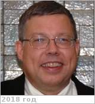

# Peterson, Craig E.
> 2019.10.11 ┊ **🚀 [despace](index.md)** → **[Contact](contact.md)**

|*[Org.](contact.md)*|*US. Senior Spacecraft Systems Engineer & Space Mission Architect. Senior Private Consultant*|
|:--|:--|
|B‑day, addr.| <mark>нетдаты</mark> 1955 ? / Los Angeles, California |
|E‑mail| <mark>noemail</mark> |
|i18n| <mark>TBD</mark> |
|Tel| *раб.:* <mark>noworkphone</mark>; *моб.:* <mark>нетмобильного</mark> |
||  <mark>нетподписи</mark>  |

   - **[Education](edu.md):** Graduate Course, California Institute of Technology, Space Systems Engineering, 1996 ‑ 1997. BA, Mathematics, Gustavus, 1973 ‑ 1977.
   - **Exp.:** 1985 ‑ 2009 JPL.
   - …
   - **SC/Equip.:** 2007 [Venus Flagship Mission](venus_flagship_mission.md), 2003 [Venus Sample Return Mission](venus_sample_return_mission.md)
   - **Conferences:** …
   - Git: …
   - Facebook: <https://www.facebook.com/craig.peterson.3323/>
   - Instagram: <mark>нетинсты</mark>
   - LinkedIn: <https://www.linkedin.com/in/craig-peterson-b09a171/>
   - Twitter: <mark>неттви</mark>
   - <https://www.researchgate.net/profile/Craig_Peterson4>
   - **As a person:**
      1. …
