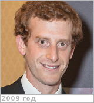

# Rabinovitch, Jason
> 2019.07.16 **[🚀](../index/index.md) [despace](index.md)** → [Contact](contact.md)

|*[Org.](contact.md)*|*[JPL](zz_jpl.md), US. Mechanical Engineer*|
|:--|:--|
|B‑day, addr.|<mark>nodate</mark> 1987 (Toronto, CA) / Los Angeles, US|
|E‑mail|<jason.rabinovitch@jpl.nasa.gov>|
|i18n|<mark>TBD</mark>|
|Tel|*раб.:* +1(626)487-49-17; *mobile:* <mark>nomobile</mark>|
|| <mark>nosign</mark>|

   - **[Education](edu.md):** PhD, Aeronautics, Caltech, 2014. MS, Mécanique des Fluides Fondements & Applications, École Polytechnique Paris, 2011. MS, Aerospace Engineering, Caltech, 2009. BS, Mechanical Engineering, Yale Univ., 2008.
   - **Exp.:** Skills & Expertise: Fluid Mechanics, Computational Fluid Dynamics, Numerical Modeling, CFD Simulation, Computational, Fluid Mechanics, Vortex, Multiphase Flow, Hypervelocity Flows. ┊ In 2020 took part of the team developing fat-production IMUs for COVID-19.
   - …
   - **SC/Equip.:** …
   - **Conferences:** 2019 [VD Workshop 2019](vdws2019.md)
   - Git: …
   - Facebook: <https://www.facebook.com/jason.rabinovitch>
   - Instagram: <mark>noin</mark>
   - LinkedIn: <https://www.linkedin.com/in/jason-rabinovitch-729b3185>
   - Twitter: <https://twitter.com/j_rabinovitch>
   - <http://www.jasonrabinovitch.com/>
   - <https://scholar.google.com/citations?user=hQRtV44AAAAJ&hl=en>
   - <https://www.researchgate.net/profile/Jason_Rabinovitch>
   - **As a person:**
      1. …
