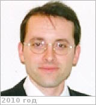

# Rosenblatt, Pascal
> 2019.10.12 ┊ **[🚀](../index/index.md) [despace](index.md)** → [Contact](contact.md)

|*[Org.](contact.md)*|*GEOAZUR, FR. Senior Scientist in planetary geodesy*|
|:--|:--|
|B‑day, addr.| <mark>nodate</mark> 1966.… Paris, FR / … |
|E‑mail| <mark>noemail</mark> |
|i18n| <mark>TBD</mark> |
|Tel| *work:* <mark>noworkphone</mark>; *mobile:* <mark>nomobile</mark> |
||  <mark>nosign</mark>  |

   - **[Education](edu.md):** PhD, comparative planetology, Paul Sabatier Univ. in Toulouse, France, 1995. MS, mathematics & physics, Paul Sabatier Univ. in Toulouse, France, 1989. He studied geology & geophysics of terrestrial planets during his post‑doc activities (1996 ‑ 98), including a three‑month visit at Prof. [J. Head’s](zz_head1.md) laboratory in Brown University, Providence, USA.
   - **Exp.:** Since 2001, he is responsible at ROB for radio‑tracking data processing of planetary probes (using the GINS software). He is an expert in Precise Orbit Determination (POD) of SC orbiting around planet & in retrieval of geophysical parameters of the planet from the POD. Since 2009, he is Co‑I on the Mars Express (MEX) Radioscience experiment (MaRs) & on the [Venus Express](venus_express.md) (VEX) radio‑science experiment (VeRa). He is in charge of improving the determinations of the time variable Martian gravity field & of determining the gravity field of the Martian moons Phobos & Deimos, using the radio‑tracking data of MEX as well as Mars Global Surveyor (MGS) & Mars Odyssey SC (ODY) & Mars Reconnaissance Orbiter (MRO). His work also aims at determining the density of the high atmosphere of Venus, using the tracking data of VEX. Since 2009, he’s senior scientist & supervises the works, performed at ROB, which deals w/ present or future tracking data of planetary orbiter or Lander on planetary surface. He’s also teaching geophysics of planetary interior at Catholic Univ. of Louvain (UCL) & since 2010 he’s member of the Belgian National Committee of Geodesy & Geophysics. He’s (at 2010.07) author(co) of 161 comms in international meetings & of 16 publications in peer reviewed journals.
   - Experienced Researcher with a demonstrated history of fundamental research in academic positions. Skilled in Physics, data handling & processing. Strong research professional focused in scientific exploration of solar system.
   - **SC/Equip.:** … [EnVision](envision.md)
   - **Conferences:** 2019 [IVC](ivc_2019.md)
   - Git: …
   - Facebook: <mark>nofb</mark>
   - Instagram: <mark>noin</mark>
   - LinkedIn: <https://www.linkedin.com/in/pascal-rosenblatt-9645ab76/>
   - Twitter: <mark>notw</mark>
   - <https://scholar.google.be/citations?user=n4mJ_DYAAAAJ&hl=fr>
   - <https://www.researchgate.net/profile/Pascal_Rosenblatt>
   - <http://www.raa-journal.org/docs/authors/1008_invited_authors.html>
   - **As a person:**
      1. …
