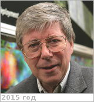

# Russell, Christopher Thomas
> 2019.04.01 ┊ **[🚀](../index/index.md) [despace](index.md)** → [Contact](contact.md)

|*[Org.](contact.md)*|*UCLA, US. Head of the Space Physics Center at the Institute of Geophysics & Planetary Physics (IGPP) at UCLA, professor in UCLA’s Department of Earth, Planetary, & Space Sciences, & Director of the UCLA Branch of the California Space Grant Consortium*|
|:--|:--|
|B‑day, addr.| 1943.09.05 (St. Albans, England) / … |
|E‑mail| <ctrussel@igpp.ucla.edu> |
|i18n| <mark>TBD</mark> |
|Tel|*раб.:* +1(310)825-31-88; *mobile:* <mark>nomobile</mark> |
||  <mark>nosign</mark> |

   - **[Education](edu.md):** PhD, California Univ. Univ., Los Angeles, 1968. BS, Toronto Univ., 1964.
   - **Exp.:** Research. He led the Magnetic Fields Experiments on NASA’s Polar satellite to map the earth’s magnetosphere. He leads NASA’s Dawn Mission team. Dawn orbited Vesta in 2011 & 2012 & has entered the orbit of Ceres in 2015. It is the first spacecraft to orbit two celestial bodies. In collaboration with John L. Philips he has studied the ashen light on Venus. He has studied the solar wind through his participation in NASA’s STEREO & the European Space Agency’s Venus Express missions.
   - …
   - **SC/Equip.:** 1978 [Pioneer Venus 1](pioneer_venus_1.md)
   - **Conferences:** …
   - Git: …
   - Facebook: <mark>nofb</mark>
   - Instagram: <mark>noin</mark>
   - LinkedIn: <mark>noli</mark>
   - Twitter: <mark>notw</mark>
   - <https://en.wikipedia.org/wiki/Christopher_T._Russell>
   - <http://venus.wisc.edu/mission_participants.html>
   - <http://epss.ucla.edu/people/faculty/>
   - <http://www-ssc.igpp.ucla.edu/personnel/russell.html>
   - **As a person:**
      1. …
