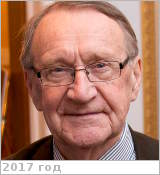

# Сагдеев, Роальд Зиннурович
> 2019.11.16 ┊ **🚀 [despace](index.md)** → **[Contact](contact.md)**

|*[Org.](contact.md)*|*UMD, US. Профессор*|
|:--|:--|
|B‑day, addr.| 1932.12.26 Москва, СССР / … |
|E‑mail| <mark>noemail</mark> |
|i18n| Sagdeev, Roald Zinnurovich |
|Tel| *раб.:* <mark>noworkphone</mark>; *моб.:* <mark>нетмобильного</mark> |
||  <mark>нетподписи</mark>  |

   - **[Education](edu.md):** Академик РАН (1991, академик АН СССР с 1968 года, член‑корреспондент АН СССР с 1964 года). Доктор физико‑математических наук.
   - **Exp.:** С 1973 по 1988 годы был директором Института космических исследований АН СССР. Занял эту должность как ведущий специалист страны в области физики плазмы. Затем — руководителем научно‑методического центра аналитических исследований Института, главным научным сотрудником. Профессор, директор Центра «Восток‑Запад» Университета штата Мэриленд, США, эксперт НАСА, член Наблюдательного совета Международного Люксембургского форума по предотвращению ядерной катастрофы.
   - Советский и американский физик. Действительный член РАН (академик АН СССР с 1968). В 1973—1988 гг. директор Института космических исследований АН СССР. Народный депутат Верховного Совета СССР (1987—1991). Герой Социалистического Труда (1986). Труды по физике плазмы (ударные волны, процессы переноса, неустойчивости), проблеме управляемого термоядерного синтеза, космической физике.
   - **SC/Equip.:** 1984 [Вега‑1/2](vega_1_2.md)
   - **Conferences:** …
   - Git: …
   - Facebook: <mark>нетфб</mark>
   - Instagram: <mark>нетинсты</mark>
   - LinkedIn: <mark>нетин</mark>
   - Twitter: <mark>неттви</mark>
   - <https://ru.wikipedia.org/wiki/Сагдеев,_Роальд_Зиннурович>
   - **As a person:**
      1. …
