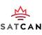

# SatCan
> 2019.08.15 [🚀](../index/index.md) [despace](index.md) → [Contact](contact.md)

||<info@satcan.ca>, +1(613)265-46-31, Fax: …;  *227 Centrepointe Drive, Ottawa, ON, K2G 5L5, Canada*|
|:--|:--|
|Link|<https://www.satellitecanada.org/>  <https://twitter.com/SatelliteCanada>  <https://www.linkedin.com/company/satellite-canada-innovation-network/>|
|**Mission**|…|
|**Vision**|…|
|**Values**|…|
|**Business**|…|
|**[Manage- ment](mgmt.md)**|…|

**Satellite Canada Innovation Network (SatCan)** is a member-based, [non-for-profit organization](nonprof_org.md) dedicated to driving the global competitiveness of the Canadian space industry by facilitating the development of new companies, revolutionary products, & disruptive services with the speed & success of industry.  
SatCan is an engineering & business services organization offering extensive support to companies in the satellite telecom & space technology sectors.  
Through our extensive network of contacts & consultants, & our depth of experience across multiple business & engineering disciplines, SatCan can help you gain access to space technology programs, complement your program efforts with key skills & resources, or lead & staff a complete project.

Satellite Canada Innovation Network Inc. ("SatCan") is a visionary initiative launched to grow Canada’s leadership position in the global space industry, & advance the government’s Innovation Agenda.

Leveraging proven international business models for Space Technology Accelerators, SatCan is a registered, non-for-profit, member-based corporation, in the role of a catalyst dedicated to driving significant growth for the Canadian space industry.

 

…
