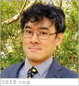

# Sayanagi, Kunio M.
> 2019.07.07 ┊ **🚀 [despace](index.md)** → **[Contact](contact.md)**

|*[Org.](contact.md)*|*[Hampton Univ.](hampton_univ.md), US. Atmospheric & Planetary Sciences. Associate Professor (2017)*|
|:--|:--|
|B‑day, addr.| 1977.10.01 / … |
|E‑mail| <kunio.sayanagi@hamptonu.edu> |
|i18n| <mark>TBD</mark> |
|Tel|*раб.:* +1(757)728-67-45, fax: +1(757)727-50-90; *моб.:* <mark>нетмобильного</mark> |
||  <mark>нетподписи</mark> |

   - **[Education](edu.md):** PhD, Physics with Minor in Atmospheric Sciences, Arizona University, 2007 / MS, Physics, Arizona University, 2004.
   - **Exp.:** Dr. Sayanagi has taught the following courses at Hampton University: Introductory Astronomy / Atmospheric & Planetary Sciences Seminar / Atmospheric Structure & Dynamics / Geophysical Fluid Dynamics / Special Topics: Atmospheric Turbulence / Physics & Chemistry of Planetary Atmospheres. His research interests encompass a wide range of topics in planetary atmospheres. Research activities: 3 rough areas. 1st, he studies atmospheric dynamic phenomena by numerically modeling atmospheric features such as jetstreams, vortices & waves. 2nd, he analyzes images from space probes to analyze clouds; in particular, images from NASA’s Cassini to study motions & properties of clouds on Saturn. 3rd, he develops measurement methods & image processing techniques to improve & enable new analysis of images from space missions.
   - …
   - **SC/Equip.:** …
   - **Conferences:** 2019 [IVC](ivc_2019.md)
   - Git: …
   - Facebook: <https://www.facebook.com/kunio>
   - Instagram: <mark>нетинсты</mark>
   - LinkedIn: <https://www.linkedin.com/in/kunio-sayanagi-04180213>
   - Twitter: <https://twitter.com/windyplanets>
   - <https://youtube.com/channel/UCWd7dOVQJTZb13K64LWoiSg>
   - <http://cas.hamptonu.edu/profile/kunio-sayanagi/>
   - <https://science.hamptonu.edu/aps/faculty/sayanagi.cfm>
   - **As a person:**
      1. …
