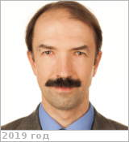

# Щеглов, Георгий Александрович
> 2020.02.11 ┊ **🚀 [despace](index.md)** → **[Contact](contact.md)**

|*[Org.](contact.md)*|*[МГТУ Баумана](zz_мгтубаумана.md), RU. Факультет «Специальное машиностроение», кафедра «Аэрокосмические системы». Профессор*|
|:--|:--|
|B‑day, addr.| <mark>нетдаты</mark> / … |
|E‑mail| <shcheglov_ga@bmstu.ru> |
|i18n| Schheglov, Georgii A. |
|Tel| *раб.:* +7(499)263-63-10; *моб.:* +7(910)481-69-06 |
||  <mark>нетподписи</mark>  |

   - **[Education](edu.md):** 1996, Д.т.н. (ScD), МГТУ Баумана.
   - **Exp.:** Специалист в области динамики и прочности летательных аппаратов, аэрогидроупругости и вихревых методов вычислительной гидродинамики, занимается также вопросами проектирования космических аппаратов. Автор 97 научных работ.
   - Медаль Федерации космонавтики им. В.Н. Челомея, Благодарность Министерства Образования, Медаль Циолковского Федерации космонавтики.
   - **SC/Equip.:** …
   - **Conferences:** 2020 Королёвские чтения.
   - Git: …
   - Facebook: <mark>нетфб</mark>
   - Instagram: <mark>нетинсты</mark>
   - LinkedIn: <mark>нетин</mark>
   - Twitter: <mark>неттви</mark>
   - <https://sm.bmstu.ru/faculty/departments/sm2/39-professorsko-prepodavatelskiy-sostav.html>
   - **As a person:**
      1. …
