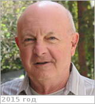

# Schubert, Gerald
> 2019.10.16 [🚀](../index/index.md) [despace](index.md) → [Contact](contact.md)

|*[Org.](contact.md)*|*UCLA, US. Institute of Geophysics & Planetary Physics. Department of Earth & Space Sciences. Professor*|
|:--|:--|
|B‑day, addr.|1939.03.02 New York, US / …|
|Contact|<schubert@ucla.edu>, *work:* +1(310)825-45-77; *mobile:* +1(310)825-27-79|
|i18n|<mark>TBD</mark>|
|| |

   - **[Education](edu.md):** PhD, Engineering Aeronautical Sciences, California Univ., Berkeley, 1964. MS, Aeronautical Engineering, Cornell Univ., 1961. BS, Engineering Physics & M.S. in Aeronautical Engineering, Cornell University, 1961.
   - **Exp.:** Research interests: Physics of Earth & Planets, Dynamics of Planetary Interiors & Atmosphere, Evolution of Earth & Planets, Mantle Convection, Magnetic Fields of Earth & Planets, Planetary Dynamos & Geodynamo.
   - Professional societes: [American Geophysical Union](agu.md), American Association for the Advancement of Science, [Division of Planetary Sciences](dps.md), American Astronomical Society. Positions held: Professor, Department of Earth & Space Sciences, Institute of Geophysics & Planetary Physics, California Univ., Los Angeles (1974 ‑ present). Associate Professor, Department of Geophysics & Space Physics, California Univ., Los Angeles (1970 ‑ 1974). Assistant Professor, Department of Geophysics & Space Physics, California Univ., Los Angeles (1966 ‑ 1970). National Academy of Sciences National Research Council Postdoctoral Fellow, Department of Applied Mathematics & Theoretical Physics, Cambridge University, Cambridge, England (1965 ‑ 1966). Member of Technical Staff, Bell Telephone Research Lab., Whippany, New Jersey (1965). Head, Advanced Heat Transfer & Fluid Flow Department, Instructor in Nuclear Reactor Physics, U.S. Naval Nuclear Power School, Mare Island, California (1961‑1965).
   - **SC/Equip.:** 2007 [Venus Flagship Mission](venus_flagship_mission.md)
   - **Conferences:** …
   - Git: …
   - Facebook: <mark>nofb</mark>
   - Instagram: <mark>noin</mark>
   - LinkedIn: <mark>noli</mark>
   - Twitter: <mark>notw</mark>
   - <https://en.wikipedia.org/wiki/Gerald_Schubert>
   - <http://www2.ess.ucla.edu/~schubert/biography.html>
   - <https://epss.ucla.edu/people/faculty/580/>
   - **As a person:**
      1. …
