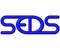

# SEDS
> 2019.09.02 [🚀](../index/index.md) [despace](index.md) → [Contact](contact.md)

||<mark>noemail</mark>, <mark>noworkphone</mark>, Fax: …;  *…*|
|:--|:--|
|Link|<http://seds.org/>  <https://en.wikipedia.org/wiki/Students_for_the_Exploration_and_Development_of_Space>|

**Students for the Exploration & Development of Space (SEDS)** is an international student organization whose purpose is to promote space exploration & development through educational & engineering projects.

Students for the Exploration & Development of Space was founded in 1980 at MIT by Peter Diamandis, Princeton University by Scott Scharfman, & Yale University by Richard Sorkin, & consists of an international group of high school, undergraduate, & graduate students from a diverse range of educational backgrounds who are working to promote space. SEDS is a chapter‑based organization with chapters in Canada, India, Israel, Mexico, Nepal, Nigeria, Philippines, Spain, Turkey, United Kingdom, & United States. The permanent National Headquarters for SEDS‑USA resides at MIT & that of SEDS‑India resides at Vellore Institute of Technology. Though collaboration is frequent, each branch & chapter is independent & coordinates their own activities & projects.

 

SEDS is organized by country, region, & chapter. There is a large contingent of SEDS chapters in the United States, which are governed regionally & nationally by SEDS‑USA. SEDS India has nine SEDS chapters under it & is headquartered at Vellore Institute of Technology. There are other national sections of SEDS across the world, notably SEDS‑Canada & UKSEDS, & student leaders of the international groups convene as SEDS‑Earth, the global governing body of SEDS. SEDS is an organization member of the Alliance for Space Development.

**SEDS‑USA**  
SEDS‑USA is the governing body of all chapters in the United States, & is the largest & original branch of SEDS. It is overseen by a national Board of Directors, Board of Advisers & a Board of Trustees. An integral aspect of SEDS‑USA is the Council of Chapters (CoC). This council consists of national representatives of each chapter & is led by the Chair of the Council of Chapters. The CoC meets via teleconference to exchange updates between individual chapters & the national board. The 2018–19 national directors of SEDS‑USA are listed below.

**[UKSEDS ⎆](http://ukseds.org/)**  
UK Students for the Exploration & Development of Space (UKSEDS) is the UK’s national student space society. They support students & enthusiasts across the United Kingdom by running space projects, hosting conferences & workshops, & doing outreach to inspire & educate. They build links between different parts of the space community within the UK & internationally. Their current chair is Anuradha Damale. UKSEDS began in 1988, when several students who had attended International Space University (ISU)’s first Space Studies Program which was held at MIT made the decision to set up the organisation in the UK. A founding conference was held in March 1989 at London’s Science Museum, with a full conference at Cambridge University in November of that year.

**[SEDS‑Canada ⎆](http://seds.ca/)**  
SEDS‑Canada is a federally incorporated not‑for‑profit organization based in Toronto, Canada, whose mandate is to advocate for the exploration & development of space through non‑partisan political advocacy, conferences, student competitions, & chapter grants. The organization was initiated in early 1981 by entrepreneur Bob Richards, & it was re‑established in 2014 by a group of students from the University of Toronto & the University of Western Ontario after several years of inactivity. SEDS‑Canada currently has eleven university chapters operating across the country. As part of their advocacy goals, SEDS‑Canada seeks to engage Canadian policy makers & electoral candidates at all levels of government in a multi‑year effort with the aim of defending cuts to good space policy, & campaigning for new policies to ensure Canadian leadership in niche areas of space exploration & development.

**SEDS‑Turkey**  
Space Exploration & Development of Space Turkey, founded in March 2017 by 15 young entrepreneurs at Hacettepe University, is the first & only national space & entrepreneurial organization with its 350+ active members & branches in 8 universities as of January 2019. SEDS TR’s goal is to gather all interested undergraduates, master’s degree students, & doctoral students & to carry out tasks that help them improve their career prospects in their field of activity by establishing a common working platform. In order to reach this goal, SEDS TR has been working on engineering projects, organizing events & extending its area of effect by founding SEDS organizations in universities throughout Turkey & in respect to this, SEDS is trying to make operations & work done mentioned above accessible to every other student in Turkey.

**SEDS‑UAE**  
The SEDS‑UAE Chapter is based at the Our Own English High School in Abu Dhabi. This chapter was founded by a high school student, Nishirth Khandwala. Members of SEDS UAE engage themselves in various activities & programs such as the International Asteroid Search Campaign.

**[SEDS India ⎆](http://sedsindia.org)**  
SEDS‑India is the governing body of SEDS in India with its headquarters at Vellore Institute of Technology. SEDS India was founded in 2004 by Pradeep Mohandas & Abhishek Ray. The first chapter was established in Mumbai at PIIT, New Panvel. SEDS India governs affiliated chapters in India at various universities, including Vellore Institute of Technology, Veltech University, Birla Institute of Technology & Science Pilani‑Goa, Sri Ramakrishna Engineering College & SASTRA University. Chapter affairs are controlled by the Local Chapter Committee which reports to the Executive Board of SEDS India. The Executive Board of SEDS India consists of six Board Members who are selected through a voting process, with all individual members of SEDS India being eligible to vote. The Permanent Trustee of SEDS India is Geetha Manivasagam, Vellore Institute of Technology. The advisory panel has multiple dignitaries on its board, including the Associate Director of Vikram Sarabhai Space Center. The main outreach program of SEDS India is called OneSpace. OneSpace was founded to spread awareness about & engagement with space among underprivileged children in rural India & children residing in local orphanages. Attempts have also been made by SEDS India to outreach to northeast India, where access to space education & technical projects is more difficult. These efforts were led with the help of Angaraj Duara, an alumnus of Maharishi Vidyamandir Shilpukhuri, Guwahati, & established seven chapters in Assam. They are the Army Public School Narangi, Sharla Birla Gyan Jyoti School Guwahati, IIT‑Guwahati, Handique Girls College, Royal Global Institute — RSET Guwahati, Donbosco Public School Panbazar & Tezpur University. SEDS‑APSN was the first chapter in northeast India. A separate SEDS‑NorthEast governing body oversees activities in the northeast.
