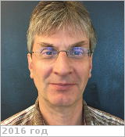
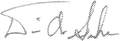

# Senske, David
> 2019.04.01 ┊ **[🚀](../index/index.md) [despace](index.md)** → **[Contact](contact.md)**

|*[Org.](contact.md)*|*[NASA](zz_nasa.md), [JPL](zz_jpl.md), US. Venus Science & Technology Definition Team (STDT). Vice-Chair*|
|:--|:--|
|B‑day, addr.| 1961.06.18 (Oregon, USA) / … |
|E‑mail| <David.A.Senske@jpl.nasa.gov> |
|i18n| <mark>TBD</mark> |
|Tel|*раб.:* <mark>noworkphone</mark>; *mobile:* <mark>nomobile</mark> |
||   |

   - **[Education](edu.md):** …
   - **Exp.:** …
   - **SC/Equip.:** 2007 [Venus Flagship Mission](venus_flagship_mission.md)
   - **Conferences:** …
   - Git: …
   - Facebook: <mark>nofb</mark>
   - Instagram: <mark>noin</mark>
   - LinkedIn: <mark>noli</mark>
   - Twitter: <mark>notw</mark>
   - <http://vfm.jpl.nasa.gov/peoplevfm/>
   - **As a person:**
      1. …
