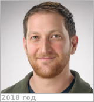

# Smith, David Joseph
> 2019.07.16 **[🚀](../index/index.md) [despace](index.md)** → [Contact](contact.md)

|*[Org.](contact.md)*|*[ARC](zz_arc.md), US. Space Biosciences Research Branch. Deputy Branch Chief*|
|:--|:--|
|B‑day, addr.| <mark>nodate</mark> 1986 / … |
|E‑mail| <david.j.smith-3@nasa.gov> |
|i18n| <mark>TBD</mark> |
|Tel|*раб.:* +1(650)604-48-19; *mobile:* <mark>nomobile</mark> |
||  <mark>nosign</mark> |

   - **[Education](edu.md):** PhD, Biology & Astrobiology, Washington Univ., 2012. BA, Ecological & Evolutionary Biology, Princeton Univ., 2007.
   - **Exp.:** Researcher & project scientist who studies microbial dispersal with traditional & molecular methods. At Kennedy Space Center, he gained ground- & spaceflight-based project experience with NASA instruments & payloads in the space shuttle, International Space Station, & Reduced Gravity Research Programs. More recently, he led the design, construction, & validation of a novel NASA Planetary Protection payload (E-MIST) that was flown twice by the NASA Balloon Program. Skills & Expertise: Microbiology, Microbial Molecular Biology, Environmental Microbiology, Microbial Ecology, Bacteria, Atmosphere, Fungi, Microbial Diversity, Aerosols, Atmospheric Modeling, Microorganisms, Bacillus, Bacterial Cells, Microbiological Methods, Aerobiology, Extreme Environments.
   - …
   - **SC/Equip.:** 2019 [Venus Observing System](venus_observing_system.md)
   - **Conferences:** 2019 [VD Workshop 2019](vdws2019.md)
   - Git: …
   - Facebook: <https://www.facebook.com/david.j.smith.566148>
   - Instagram: <mark>noin</mark>
   - LinkedIn: <https://www.linkedin.com/in/david-j-smith-b137b9177>
   - Twitter: <mark>notw</mark>
   - <https://www.nasa.gov/ames/research/space-biosciences/david-j-smith>
   - <https://www.nasa.gov/ames/research/space-biosciences/david-j-smith-laboratory>
   - <https://scholar.google.com/citations?user=mKcp6SoAAAAJ&hl=en>
   - <https://www.researchgate.net/profile/David_Smith61>
   - **As a person:**
      1. …
