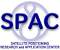

# SPAC
> 2020.06.05 **[🚀](../index/index.md) [despace](index.md)** → [Contact](contact.md)

||*Kikai-Shinkou-Kaikan Bldg.3F, 3-5-8 Shibakoen, Minato-ku, Tokyo, 105-0011*|
|:--|:--|
|E‑mail| <office@eiseisokui.or.jp> |
|Link| <http://www.eiseisokui.or.jp/en/> |
|Tel| +81-3-5402-4738, ℻: +81-3-5402-4712 |

**Satellite Positioning Research and Application Center (SPAC)** is a Japan organization aimed to expand the utilization of geospatial information within industrial and economic sectors including linkage with companies and associations related to satellite positioning. Founded in 2007.02.05.

The objectives of the SPAC is to contribute to the achievement of advanced Geo‑spatial Information society and the development of domestic industries and the international society by, aiming the wide‑spread usage of Geo‑spatial Information in industrial and economical fields, promoting research and application regarding next generation satellite‑based positioning, navigation and timing(PNT) in the world in cooperation with related industries andorganizations, wide dissemination of above obtained knowledge, activating and promoting the business activities in Geo‑spatial Information utilising PNT.

It is owned by 4 Japanese government departments:

   - the Ministry of Education, Culture, Sports, Science and Technology,
   - the Ministry of Internal Affairs and Communications,
   - the Ministry of Economy, Trade and Industry,
   - the Ministry of Land, Infrastructure, Transport and Tourism.

 

## SPAC, comments

**Message from Chairperson**

<small>Satellite positioning has a wide variety of applications within Japan starting with car navigation, personal navigation & mapping, as well as including various fields such as precise agriculture, aero survey, construction, logistics, traffic, tourism, security, environmental protection, disaster prevension & e‑commerce, so on. Use of such positioning technology has so deeply penetrated both public life & the national economy in areas such as national land management, scientific & technical research, industrial & economic activities, & the security & peace of mind of the citizenry, that it is now an essential element of our social infrastructure in terms of national stability & development.   Outside of Japan, the plan to modernize GPS in the United States & the Galileo project in Europe demonstrate the progress that is being made on the creation of an international network of satellite positioning systems that will enable a high rate of utilization of real‑time spatiotemporal information on a global scale. Within Japan, the satellite positioning technology derived from the Quasi‑Zenith Satellite System has been incorporated into the Basic Program for Science & Technology, & has been further strengthened by its recognition as a national critical technology.   Meanwhile, our goverment enforced Basic Act on the Advancement of Utilizing Geospatial Information (NSDI Act of Japan) & authorized G‑spatial Basic Plan for the realization of a society with increased utilization of geospatial information. Also, aiming the advancement of the life of the people & the contribution for economic growth, our goverment enforced Space Basic Act & authorized Space Basic Plan. And Japan’s Quasi‑Zenith Satellite (QZS) has been launched since 2010.   SPAC performs numerous activities in order to expand the utilization of geospatial information within industrial & economic sectors including linkage with companies & associations related to satellite positioning, the promotion of research & study related to the use of next‑generation satellite positioning, such as the United State’s GPS, Europe’s Galileo project & Japan’s Quasi‑Zenith Satellite System, as well as diffusing the results of such activities, & contributing to the activation & commercialization of business activities related to geospatial information. The goals of all of our activities are to contribute to the realization of a society where geospatial information can be widely utilized, & to serving as a conduit for both the expansion of Japanese industry & contributions to the international community.</small>

