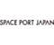

# SPJ
> 2020.07.20 **[🚀](../index/index.md) [despace](index.md)** → [Contact](contact.md)

||*6 Chome−10−1 六本木ヒルズ森タワー２３階, Roppongi, Minato City, 〒106-0032 Tokyo, Japan*|
|:--|:--|
|E‑mail| <mark>noemail</mark> |
|Link| <https://www.spaceport-japan.org/> |
|Tel| <mark>noworkphone</mark>, ℻: … |

**Space Port Japan (SPJ)** will be collaborating with relevant companies, groups, and government institutions both domestically and internationally to support efforts to open spaceports in Japan at the earliest opportunity. It will also be working with companies involved in developing and operating space planes and manned rockets taking off from the port, and striving to involve industries with no prior connection with space, all with the aim of making Japan an Asian hub for the space travel business. Founded in 2018.

**Purpose.** Promote the country’s aerospace and related industries on a wide scale by opening spaceports in Japan

**Main Activities.** SPJ becomes the hub of the spaceports in Japan and do the following activities.

   - Creating business opportunities
   - Collaboration with related companies and organizations in Japan and overseas
   - Providing information and holding study sessions and events

 

## SPJ, comments

…

