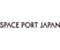

# SPJ
> 2020.07.20 [🚀](../index/index.md) [despace](index.md) → [Contact](contact.md)

||<mark>noemail</mark>, <mark>noworkphone</mark>, Fax: …;  *6 Chome−10−1 六本木ヒルズ森タワー２３階, Roppongi, Minato City, 〒106-0032 Tokyo, Japan*  【<https://www.spaceport-japan.org/>】|
|:--|:--|
|**Mission**|…|
|**Vision**|…|
|**Values**|…|
|**Business**|…|
|**[MGMT](mgmt.md)**|…|

**Space Port Japan (SPJ)** will be collaborating with relevant companies, groups, & government institutions both domestically & internationally to support efforts to open spaceports in Japan at the earliest opportunity. It will also be working with companies involved in developing & operating space planes & manned rockets taking off from the port, & striving to involve industries with no prior connection with space, all with the aim of making Japan an Asian hub for the space travel business. Founded in 2018.

**Purpose.** Promote the country’s aerospace & related industries on a wide scale by opening spaceports in Japan

**Main Activities.** SPJ becomes the hub of the spaceports in Japan & do the following activities.

   - Creating business opportunities
   - Collaboration with related companies & organizations in Japan & overseas
   - Providing information & holding study sessions & events

 

…

