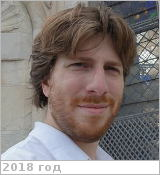

# Spiga, Aymeric
> 2019.07.08 [🚀](../index/index.md) [despace](index.md) → [Contact](contact.md)

|*[Org.](contact.md)*|*[Sorbonne Univ.](sorbonne_univ.md)/[LMD](lmd.md), EU.*|
|:--|:--|
|B‑day, addr.|<mark>nodate</mark> 1982.. / …|
|Contact|<aymeric.spiga@sorbonne-universite.fr>, *раб.:* +33(0)144-27-28-47; *mobile:* <mark>nomobile</mark>|
|i18n|Спига, Эмерик|
|| <mark>nosign</mark>|

   - **[Education](edu.md):** PhD, Université Pierre et Marie Curie in Planetary Science, 2008. MSc degree from UPMC in climate science, atmospheric physics & remote sensing, 2005.
   - **Exp.:** Research scientist in planetary science (LMD, Paris) Maître de conférences (Sorbonne Université, Paris). My research domain lies in between astrophysics & geophysical fluid dynamics. I am interested in how the most prominent atmospheric manifestations, witnessed at the planetary scale by telescopes & orbiting spacecraft, arise from smaller-scale atmospheric phenomena: turbulence, waves & instabilities. I work on various planetary atmospheres in the Solar System: from telluric planets (Mars, Venus) to giant planets (Saturn, Jupiter).
   - …
   - **SC/Equip.:** …
   - **Conferences:** 2019 [IVC](ivc_2019.md)
   - Git: …
   - Facebook: <mark>nofb</mark>
   - Instagram: <mark>noin</mark>
   - LinkedIn: <mark>noli</mark>
   - Twitter: <https://twitter.com/aymeric_spiga>
   - <http://www.lmd.jussieu.fr/~aslmd/>
   - <https://github.com/aymeric-spiga>
   - <https://scholar.google.com/citations?:user=sbcePYgAAAAJ&hl=en>
   - **As a person:**
      1. …
