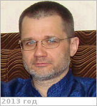
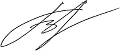

# Третьяков, Владислав Иванович
> 2019.04.01 **[🚀](../index/index.md) [despace](index.md)** → [Contact](contact.md)

|*[Org.](contact.md)*|*[ИКИ РАН](zz_iki_ras.md), RU. Отдел № 63 «Ядерной планетологии». Лаб. № 633 «Исследований элементного состава грунта Луны и планет». Научный сотрудник*|
|:--|:--|
|B‑day, addr.| <mark>nodate</mark> / … |
|E‑mail| <vladtr@mx.iki.rssi.ru> |
|i18n| <mark>TBD</mark> |
|Tel|*раб.:* +7(495)333-41-23, ℻: +7(495)333-12-48; *mobile:* +7(916)638-14-18 |
||   |

   - **[Education](edu.md):** …
   - **Exp.:** …
   - …
   - **SC/Equip.:** …
   - **Conferences:** …
   - Git: …
   - Facebook: <mark>nofb</mark>
   - Instagram: <mark>noin</mark>
   - LinkedIn: <mark>noli</mark>
   - Twitter: <mark>notw</mark>
   - <https://np.cosmos.ru/lyudi>
   - **As a person:**
      1. …
