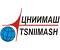

# ЦНИИмаш
> 2019.08.06 [🚀](../index/index.md) [despace](index.md) → [Contact](contact.md)

||<corp@tsniimash.ru>, +7(495)513-59-51, Fax: +7(495)512-21-00;  *Россия, 141070, Московская область, г. Королёв, ул. Пионерская, д. 4*  【<http://new.tsniimash.ru/>】|
|:--|:--|
|**Mission**|…|
|**Vision**|…|
|**Values**|…|
|**Business**|…|
|**[MGMT](mgmt.md)**|…|

**АО «Центральный научно‑исследовательский институт машиностроения (ЦНИИмаш)»** в ведении [Роскосмоса](zz_roskosmos.md) занимается проектированием, экспериментальной отработкой и исследованиями космических аппаратов и ракет. В состав института входит ЦУП Роскосмоса. Находится в городе Королёв. Член [IAF](zz_iaf.md) с 2004 г.

**Проезд.** Для входа на территорию АО «ЦНИИмаш» необходимы пропуск (заказывается заранее) и паспорт. Бюро пропусков работает с 8:30 до 17:00, перерыв с 13:00 до 14:00.

   - **Проезд железнодорожным транспортом из г. Москвы.** С Ярославского вокзала на электропоезде до станции «Подлипки‑Дачные». Далее автобусом или маршрутным такси №1 до остановки «Проходная ЦНИИмаш».
   - **Проезд на автотранспорте из г. Москвы.** От станции метро ВВЦ на автобусе № 392, 576 до остановки «Проходная ЦНИИмаш».
   - **Проезд на автотранспорте из г. Мытищи.** От ж/д станции «Мытищи» на автобусе № 28 до остановки «Проходная ЦНИИмаш» в г. Королёв.

 

…
