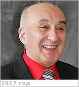

# Твердислов, Всеволод Александрович
> 2019.08.12 ┊ **🚀 [despace](index.md)** → **[Contact](contact.md)**

|*[Org.](contact.md)*|*[МГУ](мгу.md), RU. Зав. кафедрой биофизики физического факультета, с 1 марта 1964*|
|:--|:--|
|B‑day, addr.| 1941.01.07 (Москва, СССР) / Москва, РФ |
|E‑mail| <tverdislov@mail.ru> |
|i18n| <mark>TBD</mark> |
|Tel|*раб.:* +7(495)939-11-95; *моб.:* <mark>нетмобильного</mark> |
||  <mark>нетподписи</mark>  |

   - **[Education](edu.md):** Доктор физико‑математических наук с 1984 года.
   - **SC/Equip.:** …
   - Все́волод Алекса́ндрович Тверди́слов — советский и российский биофизик, заслуженный профессор МГУ, заведующий кафедрой биофизики физического факультета МГУ (с 1989 года). Дважды лауреат Ломоносовской премии в области науки (2001) и области образования (2009).
   - **Conferences:** [2019 VD Workshop](vdws2019.md)
   - Git: …
   - Facebook: <mark>нетфб</mark>
   - Instagram: <mark>нетинсты</mark>
   - LinkedIn: <mark>нетин</mark>
   - Twitter: <mark>неттви</mark>
   - <https://ru.wikipedia.org/wiki/Твердислов,_Всеволод_Александрович>
   - <https://istina.msu.ru/profile/Tverdislov/>
   - **As a person:**
      1. …
