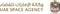

# UAESA
> 2019.08.13 [🚀](../index/index.md) [despace](index.md) → [Contact](contact.md)

||<mark>noemail</mark>, +971(2)202-22-22, Fax: …;  *CJJC+Q5 Abu Dhabi, United Arab Emirates*|
|:--|:--|
|Link|<https://space.gov.ae/>  <https://en.wikipedia.org/wiki/United_Arab_Emirates_Space_Agency>|

The **United Arab Emirates Space Agency (UAESA)** is an agency of the United Arab Emirates government responsible for the development of the country’s space industry. It was created in 2014 & is responsible for developing, fostering & regulating a sustainable & world-class space sector in the UAE. The agency is charged with the growth of the sector through partnerships, academic programmes & investments in R&D, commercial initiatives, & driving space science research & exploration.

 

…

