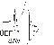

# UEF SAV
> 2019.08.05 **[🚀](../index/index.md) [despace](index.md)** → [Contact](contact.md)

||*Watsonova 47, 040 01 Košice, Slovenská republika*|
|:--|:--|
|E‑mail| <sekr@saske.sk> |
|Link| <http://uef.saske.sk/>  <https://ru.wikipedia.org/wiki/Словацкая_академия_наук> |
|Tel| +421-55-792-2201, fax: +421-55-633-62-92 |

**Ústav experimentálnej fyziky Slovenskej akadémie vied (UEF SAV)**, рус. **Институт экспериментальной физики Словацкой академии наук (ИЭФ САН)** — фундаментальные исследования в области физики конденсированных сред, ядерной и субатомной физике, физике космоса и биофизики. Институт экспериментальной физики в Кошице был создан 1 января 1969 г.

 

## UEF SAV, comments

…
