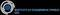

# UFA
> 2019.08.05 ┊ **🚀 [despace](index.md)** → **[Contact](contact.md)**

||*…*|
|:--|:--|
|E‑mail| <mark>нетпочты</mark> |
|Link| <http://www.ufa.cas.cz/>  <https://en.wikipedia.org/wiki/Institute_of_Atmospheric_Physics_AS_CR>  <https://cs.wikipedia.org/wiki/Ústav_fyziky_atmosféry_Akademie_věd_České_republiky> |
|Tel| <mark>нетрабочего</mark>, fax: … |
|Etc| … |

**Институт атмосферной физики** (чеш. **Ústav fyziky atmosféry Akademie věd České republiky (UFA)**, междунар. **The Institute of Atmospheric Physics AS CR (IAP)** — университет Чехии, занимается изучением атмосферы. Основан в 1964 году.

**Опыт кооперации.**  
…

 

## UFA, comments

   1. Прибор «ЛЕМРА» на ОКР [Луна‑26](луна_26.md).

