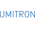

# Umitron
> 2020.10.26 [🚀](../index/index.md) [despace](index.md) → [Contact](contact.md)

||<mark>noemail</mark>, <mark>noworkphone</mark>, Fax: …;  *UMITRON K. K., Izumi Akasaka Building, 2-22-24 Akasaka, Minato, Tokyo, 107-0052, Japan*|
|:--|:--|
|Link|<https://umitron.com/>  <https://www.linkedin.com/company/umitron>  <https://twitter.com/umitron>|

UMITRON is a Singapore and Japan based deeptech company whose aim is to solve worldwide food and environmental problems by empowering aquaculture through technology. We build user-friendly data platforms for aquaculture by using IoT, satellite remote sensing, and AI. Our technology helps farmers improve farm efficiency, manage environmental risks, and increase business revenues. Our final goal is to utilize computer models in combination with aquaculture to help the world sustainably and efficiently deliver protein in a human-friendly and nature-friendly way. Ultimately, we aim to “install Sustainable Aquaculture on Earth”. Founded 2016.04.21.

   - *Mission.* Install Sustainable Aquaculture on Earth. Aquaculture is one of the most important growth industries in the 21st century. Our mission is to drive this growth by combining technology with aquaculture. UMITRON is finding solutions to difficult problems that will ultimately lead to increased food security and food safety for all. We believe fish farming is the future, and that with UMITRON’s technology we can accelerate the sustainable development of our oceans.

 

…

