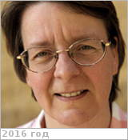

# Vandaele, Ann Carine
> 2019.10.20 [🚀](../index/index.md) [despace](index.md) → [Contact](contact.md)

|*[Org.](contact.md)*|*Royal Belgian Institute for Space Aeronomy (BIRA-ISAB), EU (BE). Head of Planetary Aeronomy Group*|
|:--|:--|
|B‑day, addr.|<mark>nodate</mark> 1960 - … / …|
|Contact|<mark>noemail</mark>, *work:* <mark>noworkphone</mark>; *mobile:* <mark>nomobile</mark>|
|i18n|<mark>TBD</mark>|
|| <mark>nosign</mark> |

   - **[Education](edu.md):** Dr. Ir., Engineering, Université libre de Bruxelles, 1990.
   - **Exp.:** Belgian Institute for Space Aeronomy, Head of Planetary Aeronomy Group, 2006 ‑ Present: Head of a group of 10 persons dealing with different aspects of planetary sciences: design of instruments for space applications, data analysis & interpretation, modeling , etc. Senior Researcher, 1991 ‑ Present; Radiative transfer in planetary atmospheres - laboratory measurement of spectroscopic parameters IR, UV) - designing instruments. Société Royale belge d'Astronomie, de Météorologie et de Physique du Globe, Chief redactor, 2004 ‑ Present; Making sure that the Bulletin of the Society gets out on time!
   - I am a civil engineer specialized in Physics. I made my thesis on the detection of urban pollution using spectroscopy. Since then I have been working in the laboratory to measure spectroscopic parameters - cross sections in the UV or line parameters in the IR, & have been involved in Earth observation projects.  I am now busy with the study of the atmospheres of bodies other than Earth, primarily Venus & Mars. I am PI of an instrument on the ESA Venus Express mission (the SOIR instrument) & my team is now building one of the instruments that will be on board the next ESA mission towards the red planet, ExoMars.
   - **SC/Equip.:** … [EnVision](envision.md), 2005 [Venus Express](venus_express.md)
   - **Conferences:** …
   - Git: …
   - Facebook: <https://www.facebook.com/anncarine.vandaele>
   - Instagram: <mark>noin</mark>
   - LinkedIn: <https://www.linkedin.com/in/ann-carine-vandaele-761581a6/>
   - Twitter: <mark>notw</mark>
   - <https://www.researchgate.net/profile/AC_Vandaele>
   - **As a person:**
      1. …
