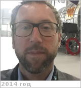

# Voirin, Thomas
> 2019.04.01 **[🚀](../index/index.md) [despace](index.md)** → [Contact](contact.md)

|*[Org.](contact.md)*|*[ESA](zz_esa.md), EU. Solar System & Robotic Exploration Missions. System Engineer*|
|:--|:--|
|B‑day, addr.| 1978.01.23 / … |
|E‑mail| <Thomas.Voirin@esa.int> |
|i18n| <mark>TBD</mark> |
|Tel|*раб.:* <mark>noworkphone</mark>; *mobile:* <mark>nomobile</mark> |
||  <mark>nosign</mark> |

   - **[Education](edu.md):** …
   - **Exp.:** …
   - …
   - **SC/Equip.:** … [EnVision](envision.md)
   - **Conferences:** …
   - Git: …
   - Facebook: <https://www.facebook.com/thomas.voirin>
   - Instagram: <mark>noin</mark>
   - LinkedIn: <https://www.linkedin.com/in/thomas‑voirin-9b85612/>
   - Twitter: <https://twitter.com/thomasvoirin>
   - **As a person:**
      1. …
