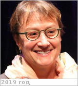

# Voytek, Mary
> 2019.07.18 ┊ **🚀 [despace](index.md)** → **[Contact](contact.md)**

|*[Org.](contact.md)*|*[NASA](zz_nasa.md), US. Headquarters. Director of the Astrobiology Program*|
|:--|:--|
|B‑day, addr.| <mark>нетдаты</mark> 1959 / … |
|E‑mail| <mary.voytek-1@nasa.gov> |
|i18n| <mark>TBD</mark> |
|Tel|*раб.:* +1(202)358-15-77, fax: +1(202)358-30-97; *моб.:* <mark>нетмобильного</mark> |
||  <mark>нетподписи</mark> |

   - **[Education](edu.md):** PhD, Biology/Ocean Sciences, California Univ., 1995. MS, Biological Oceanography, Rhode Island Univ., 1984. BA, Biology, J. Hopkins Univ., 1980.
   - **Exp.:** Dr. Voytek’s primary scientific interests are biogeochemistry & aquatic microbial ecology; more particularly, environmental controls on microbial transformations of nutrients, xenobiotics, & metals in freshwater & marine systems. She has worked in several extreme environments, including Antarctica, hypersaline lakes, deep-sea hydrothermal vents, & terrestrial deep-subsurface sites. Dr. Voytek has conducted deep-biosphere studies at the Chesapeake Bay Impact Structure.
   - …
   - **SC/Equip.:** …
   - **Conferences:** 2019 [VD Workshop 2019](vdws2019.md)
   - Git: …
   - Facebook: <https://www.facebook.com/mary.voytek.9>
   - Instagram: <mark>нетинсты</mark>
   - LinkedIn: <https://www.linkedin.com/in/mary-voytek-01118a31>
   - Twitter: <mark>неттви</mark>
   - <https://en.wikipedia.org/wiki/Mary_Voytek>
   - <https://scholar.google.co.jp/citations?user=VrcyXmgAAAAJ&hl=en>
   - <https://nai.nasa.gov/directory/voytek-mary/>
   - **As a person:**
      1. …
