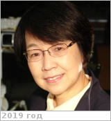

# Wang, Alian
> 2019.07.18 **[🚀](../index/index.md) [despace](index.md)** → [Contact](contact.md)

|*[Org.](contact.md)*|*[WUSTL](zz_wustl.md), US. Research Professor of Earth & Planetary Sciences (1993)*|
|:--|:--|
|B‑day, addr.|<mark>nodate</mark> 1954 / …|
|E‑mail|<alianw@levee.wustl.edu>|
|i18n|<mark>TBD</mark>|
|Tel|*раб.:* +1(314)935-58-51; *mobile:* <mark>nomobile</mark>|
|| <mark>nosign</mark>|

   - **[Education](edu.md):** **[CV](f/contact/w/wang1_cv.jpg)**. PhD, Université des Sciences, Techniques de Lille Flandres Artois, France, 1987. MS, Spectroscopy & Quantum Electronics, Peking University, China, 1982. BS, Optics, Shandong Univ., China, 1975.
   - **Exp.:** Alian Wang studies fundamental planetary science with an emphasis on the phase transformations of hydrous salts (sulfates, chloride & oxychlorine salts) on Mars, the mechanisms & environmental conditions, the phase-transition rates & pathways. She also works with planetary mission preparation, operation, & data analysis.
   - …
   - **SC/Equip.:** Mars Exploration Rover, ExoMars missions
   - **Conferences:** …
   - Git: …
   - Facebook: <mark>nofb</mark>
   - Instagram: <mark>noin</mark>
   - LinkedIn: <mark>noli</mark>
   - Twitter: <mark>notw</mark>
   - <https://eps.wustl.edu/people/alian-wang>
   - <https://scholar.google.com/citations?user=dEH4ZtIAAAAJ&hl=en>
   - <https://www.researchgate.net/profile/Alian_Wang>
   - **As a person:**
      1. …
