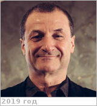

# Widemann, Thomas
> 2019.07.08 ┊ **🚀 [despace](index.md)** → **[Contact](contact.md)**

|*[Org.](contact.md)*|*[Paris Obs.](paris_obs.md), EU. Associate professor University Versailles, France, since 1995. Astronomer Paris Observatory, since 1995. Chair Science Versailles Center Research Program, France, since 2007.*|
|:--|:--|
|B‑day, addr.| 1961.04.24 (Boulogne-Billancourt, France) / … |
|E‑mail| <thomas.widemann@obspm.fr> |
|i18n| <mark>TBD</mark> |
|Tel|*раб.:* +3(313)925-56-44</mark>; *моб.:* <mark>нетмобильного</mark> |
||  <mark>нетподписи</mark> |

   - **[Education](edu.md):** PhD, University Paris, 1991.
   - **Exp.:** Astronomer, educator. Achievements include research in solar system science, atmospheric physics, history of science. Recipient Asteroid Widemann award, International Astronomical Union, 2008.
   - …
   - **SC/Equip.:** … [EnVision](envision.md)
   - **Conferences:** 2019 [IVC](ivc_2019.md)
   - Git: …
   - Facebook: <https://www.facebook.com/thomas.widemann.9>
   - Instagram: <mark>нетинсты</mark>
   - LinkedIn: <https://in.linkedin.com/pub/thomas-widemann/3b/290/818>
   - Twitter: <https://twitter.com/widemannthomas>
   - <http://www.lesia.obspm.fr/perso/thomas-widemann/>
   - <http://www.dypac.uvsq.fr/widemann-thomas-331050.kjsp>
   - **As a person:**
      1. …
