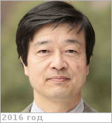

# Yamagishi, Akihiko
> 2019.04.01 ┊ **[🚀](../index/index.md) [despace](index.md)** → [Contact](contact.md)

|*[Org.](contact.md)*|*[TUPLS](zz_tupls.md), JP. Department of Molecular Biology. Professor*|
|:--|:--|
|B‑day, addr.| 1953.01.22 (Fukui-ken, Japan) / 1432-1 Horinouchi, Hachioji, Tokyo, 192-0392, Japan |
|E‑mail| <yamagish@ls.toyaku.ac.jp> |
|i18n| <mark>TBD</mark> |
|Tel|*раб.:* +81-426-76-7139; факс: +81-426-76-7145; *mobile:* <mark>nomobile</mark> |
||  <mark>nosign</mark> |

   - **[Education](edu.md):** PhD, University of Tokyo. Associate professor Tokyo University of Pharmacy & Life Science, Tokyo, since 1995, professor, since 2005. Research associate Tokyo University, 1982-1984. Visiting scientist University California, Berkeley, 1984-1986. Assistant professor Tokyo Institute of Technology, 1987-1995.
   - **Exp.:** …
   - Member American Society Microbiology, Protein Society.
   - **SC/Equip.:** …
   - **Conferences:** …
   - Git: …
   - Facebook: <mark>nofb</mark>
   - Instagram: <mark>noin</mark>
   - LinkedIn: <https://www.linkedin.com/in/akihiko-yamagishi-5b848074/>
   - Twitter: <mark>notw</mark>
   - <https://www.ls.toyaku.ac.jp/~lcb-7/yamagishi/english/index.html>
   - <https://www.researchgate.net/profile/Akihiko_Yamagishi>
   - <https://scholar.google.com/citations?user=nJDv_1UAAAAJ&hl=en>
   - <http://prabook.com/web/person-view.html?profileId=602511>
   - **As a person:**
      1. …
