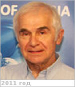

# Захаров, Александр Валентинович
> 2019.04.01 [🚀](../index/index.md) [despace](index.md) → [Contact](contact.md)

|*[Org.](contact.md)*|*[ИКИ РАН](zz_iki_ras.md), RU. Учёный секретарь*|
|:--|:--|
|B‑day, addr.|1941.06.01 Москва / Москва|
|Contact|<zakharov@iki.rssi.ru>, *раб.:* +7(495)333-20-45; *mobile:* +7(903)961-47-23|
|i18n|<mark>TBD</mark>|
| | <mark>nosign</mark>|

   - **[Education](edu.md):** Физика плазмы, Доктор физико‑математических наук. Докторская диссертация «Экспериментальные исследования ионного состава энергичной магнитосферной плазмы» (1995). МАИ.
   - **Exp.:** Член бюро секции «Солнечная система» Совета РАН по космосу, член секции «Астероидно‑кометная опасность» Экспертной рабочей группы по космическим угрозам. Учёный секретарь Научного совета по физике солнечной системы РАН. Член Международной академии астронавтики.
   - …
   - **SC/Equip.:** Марс‑96, Фобос‑Грунт
   - **Conferences:** 2019 [MSSS 10](msss_10.md)
   - Git: …
   - Facebook: <https://www.facebook.com/alexander.zakharov1>
   - Instagram: <mark>noin</mark>
   - LinkedIn: <mark>noli</mark>
   - Twitter: <mark>notw</mark>
   - <https://ru.wikipedia.org/wiki/Захаров,_Александр_Валентинович>
   - **As a person:**
      1. …
