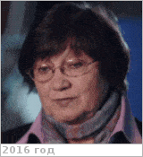

# Засова, Людмила Вениаминовна
> 2019.04.01 **[🚀](../index/index.md) [despace](index.md)** → [Contact](contact.md)

|*[Org.](contact.md)*|*[ИКИ РАН](zz_iki_ras.md), RU. Отдел № 53 «Физики планет и малых тел солнечной системы». Лаборатория № 531 «Спектроскопии планетных атмосфер». Заведующий лабораторией*|
|:--|:--|
|B‑day, addr.| 1945.05.22 / |
|E‑mail| <lzasova@gmail.com>, <zasova@iki.rssi.ru> |
|i18n| <mark>TBD</mark> |
|Tel|*раб.:* +7(495)3333-466; *mobile:* +7(903)628-23-22, +7(925)467-55-92 |
||   |

   - **[Education](edu.md):** …
   - **Exp.:** …
   - Volvo т164мк777. ┊ Несколько суетлива: всё время хочет бежать, делать, встречаться, чтобы всё и сразу.
   - **SC/Equip.:** …
   - **Conferences:** 2019 [MSSS 10](msss_10.md), 2019 [VD Workshop 2019](vdws2019.md)
   - Git: …
   - Facebook: <https://www.facebook.com/profile.php?id=100008186858321>
   - Instagram: <mark>noin</mark>
   - LinkedIn: <mark>noli</mark>
   - Twitter: <mark>notw</mark>
   - <http://www.planetary-department-iki.ru/labs/labs531.html>
   - <http://www.planetary-department-iki.ru/people.html>
   - <https://ok.ru/profile/148316222802>
   - **As a person:**
      1. Тороплива, суетлива. Выбирает «быстро и дёшего».
      1. Не умеет слушать и слышать — перебивает, не дослушивает, из сказанного может слышать отдельные части или вовсе слышать не то, что было сказано.
      1. Делает выводы и домыслы, не озвучивая их, а потом действует на их основе, а не на основе того, что было сказано.
